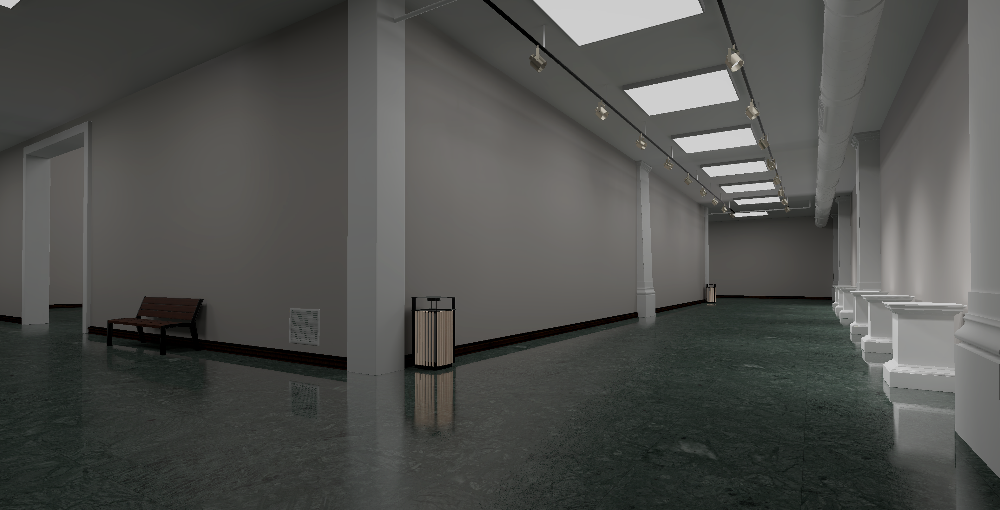
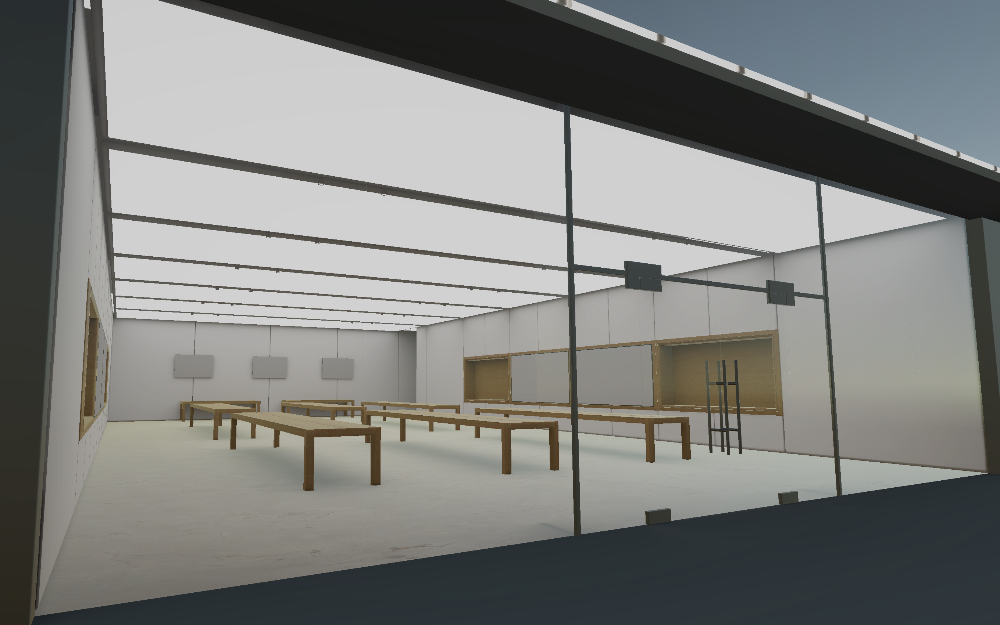

# VirtualEnvironments

Selection of virtual environments for art and design students. The environments are created from scratch and kept in relatively low poly to reduce the resource consumption when built to run in a browser. 

While the repo itself presents the environments as Unity scenes, it is also possible to replicate them in other engines or 3D software using the supplied textures and models, which can be found in the `Assets\Prefabs` folder. 

Special Thanks to [Jeremy Patterson](https://accad.osu.edu/people/patterson.680) for the support. 

# List of environments 

## Hopkins gallery 

Modelled off the actual Hopkins gallery space. This was initially created for the [Peter Megert Exhibition](https://www.asc.ohio-state.edu/design/megert/index.html).  

	

## Museum space 

Neutral space with spot lights and stands. This space was created during the process of making a [Japanese Sword demo space](https://amarthgul.itch.io/bijutsu-kaen).  

	

## Show room 

A space whose theme is based on Apple and similar consumer electronics stores. This room was originally created for [Prof. Shadrick Kuteh's](https://accad.osu.edu/people/kuteh.2) ACCAD 7103. 

	

