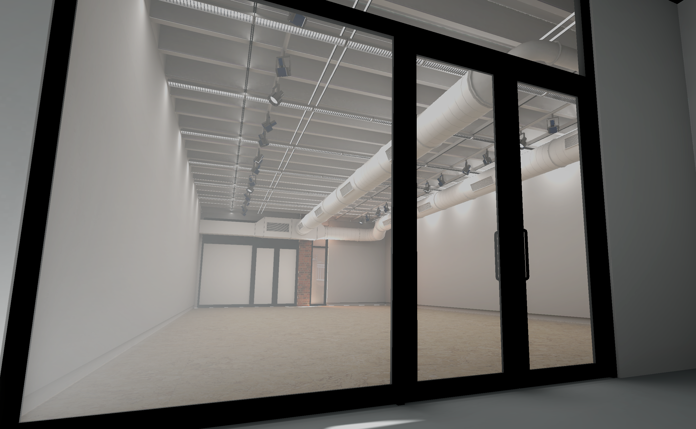

# VirtualEnvironments
Selection of virtual environments for art and design students 

# List of environments 

## Hopkins gallery 

Modelled off the actual Hopkins gallery space. This was created for the [Peter Megert Exhibition](https://www.asc.ohio-state.edu/design/megert/index.html).  

	

## Museum space 

Neutral space with spot lights and stands. This space was created for a [Japanese Sword demo space](https://amarthgul.itch.io/bijutsu-kaen).  

	

## Show room 

A space whose theme is based on Apple and similar consumer electronics stores. 

	

